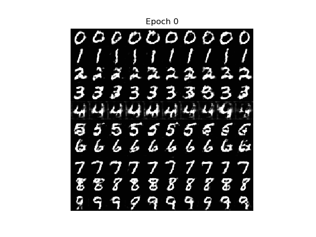

# cDCGAN on MNIST & Fashion MNIST w/ Tensorflow & Keras
This is the implementation of conditional deep convolutional generative adversarial network (cDCGAN) on the MNIST and Fashion MNIST Dataset using tensorflow and keras. The implementation is based on [this code](https://github.com/gaborvecsei/CDCGAN-Keras) by @gaborvescei. There, he implemented cDCGAN on the MNIST Dataset using Keras as well. I've added the implementation for Fashion MNIST dataset on his code.

## Setup
Install Tensorflow, Keras, Numpy, Matplotlib, os, cv2, math, subprocess.\
All of which can be installed using [Anaconda](https://www.anaconda.com/distribution/)\

Other than that, installing "Swiss-Army-Tensorboard" is also necessary. It's a modification of the usual Tensorboard by @gaborvescei\
Run this on the editor to install it:\
`pip install git+https://github.com/gaborvecsei/Swiss-Army-Tensorboard.git`

## Run
For the MNIST experiment, open the files in `CDCGAN-Keras-MNIST/cdcgan`\
There are 4 files in that folder that you need to pay attention to:
* `cdcgan_models.py` this contains the code for the model definition (The Generator & Discriminator)
* `cdcgan_utils.py` this contains the code for helper functions, such as saving the generated images
* `cdcgan_train.py` this contains the code for training the model and saving that trained model
* `test_model.ipynb` this contains the code for testing the generative capability of the trained model

I've included the model that I've trained in .... folder
Test on those models can be done by running the `test_model.ipynb` file. 
Creating and training model from scratch is also possible by running the `cdcgan_train.py` file. It'll train a new model and save it under the name ....

For the Fashion MNIST experiment, open the files in `CDCGAN-Keras-FMNIST/cdcgan`\
It'll contains the same files as the MNIST experiment one, but it'll run on the Fashion MNIST dataset.

## Experiment Results
The model was ran for 100 epochs for both the MNIST and Fashion MNIST Dataset. The images below shows the model generative performance from the first epoch until the 100th epoch.

### MNIST

### The Loss (MNIST)
The loss is visualized using the "Swiss-Army-Tensorboard". You run it the same way as how you run Tensorboard, .....

The log files is created when you're training the model, as it will log your training loss for each epoch. I've included my log file ....
The graph below will show both the Generator and Discriminator Loss of the model when training on the MNIST Dataset:
#### Generator Loss
#### Discriminator Loss

### Fashion MNIST

### The loss (Fashion MNIST)
The loss is visualized using the "Swiss-Army-Tensorboard" as well. To run it ....

#### Generator Loss
#### Discriminator Loss

## Testing the model
Below are images that are generated from the model on
