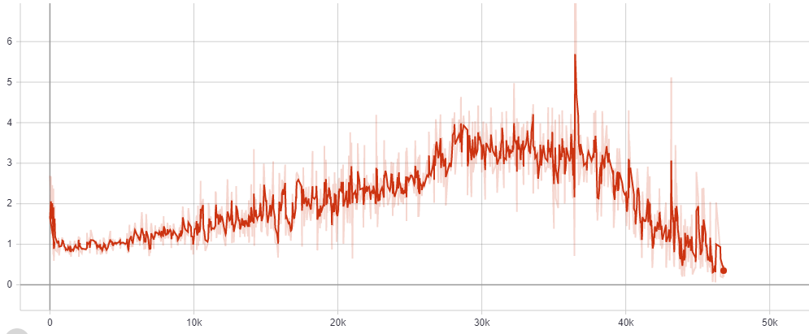

# cDCGAN on MNIST & Fashion MNIST w/ Tensorflow & Keras
This is the implementation of conditional deep convolutional generative adversarial network (cDCGAN) on the MNIST and Fashion MNIST Dataset using Tensorflow and Keras. The implementation is based on [this code](https://github.com/gaborvecsei/CDCGAN-Keras) by @gaborvescei. The example code by him runs on the MNIST Dataset. I've added the implementation for Fashion MNIST dataset on his code.

## Setup
Install Tensorflow, Keras, Numpy, Matplotlib, os, cv2, math, subprocess.\
All of which can be installed using [Anaconda](https://www.anaconda.com/distribution/)\
You also need to install Python and an editor to run the program, in my case, I use PyCharm

Installing "Swiss-Army-Tensorboard" is also necessary. It's a modification of the usual Tensorboard by @gaborvescei\
Run this on the editor to install it: `pip install git+https://github.com/gaborvecsei/Swiss-Army-Tensorboard.git`\
This is used to log the model's loss during training.

## Run
For the MNIST experiment, open the files in `CDCGAN-Keras-MNIST/cdcgan`\
For the Fashion MNIST experiment, open the files in `CDCGAN-Keras-FMNIST/cdcgan`\
There are 4 important files in each of those folders:
* `cdcgan_models.py` this contains the code for the model definition (The Generator & Discriminator)
* `cdcgan_utils.py` this contains the code for helper functions, such as saving the generated images
* `cdcgan_train.py` this contains the code for training the model and saving that trained model
* `test_model.ipynb` this contains the code for testing the generative capability of the trained model

I've included the model that I've trained in `CDCGAN-Keras-MNIST/models/weights`, for the MNIST experiment, and\
`CDCGAN-Keras-FMNIST/models/weights`, for the Fashion MNIST experiment. In those folders, you'll find these files:
* `generator.h5`, it's the generator model for the MNIST experiment.
* `discriminator.h5`, it's the discriminator model for the MNIST experiment.
* `generator_fashion_mnist.h5`, it's the generator model for the Fashion MNIST experiment.
* `discriminator_fashion_mnist.h5`, it's the discriminator model for the Fashion MNIST experiment.

The model is too big to upload on Github, so I uploaded it into Google Drive, here are the links:
* `generator.h5` &  `discriminator.h5` 
  https://drive.google.com/open?id=1OO1GBK7V5oAWK8b9p0BeRM0KET12OUNl
* `generator_fashion_mnist.h5` &  `discriminator_fashion_mnist.h5` 
  https://drive.google.com/open?id=1t_K4kuL14qmqfGfim7J7xxp_A-VkJVd7

Test on those models can be done by running the `test_model.ipynb` file on Jupyter Notebook or Google Collab.\
Creating and training model from scratch is also possible by running the `cdcgan_train.py` file. It'll train a new model and overwrite the previously saved model.

## Experiment Results
The model was run for 100 epochs for both the MNIST and Fashion MNIST Dataset.\
The gifs below show the generated images from the model from the first epoch until the 100th epoch.

### MNIST

### The Loss (MNIST)
The loss is visualized using the "Swiss-Army-Tensorboard".\
Running the "Swiss-Army-Tensorboard" is the same with running the usual Tensorboard.\
Follow these steps to run the Tensorboard:
* Open Anaconda Command Prompt.
* Go to `CDCGAN-Keras-MNIST/models`.
* Type in `tensorboard --logdir=logs/ --host=127.0.0.1`.
* Open localhost:6006 on your browser, and it'll open up Tensorboard.

On the Tensorboard, there will be graphs showing the Generator and Discriminator loss when training on the MNIST Dataset. This graph is created based on the log files. The log files is created automatically by the program when the model is being trained. I've included the log of my model training in the `CDCGAN-Keras-MNIST/models/logs/loss` folder. Here are the graphs created from the training that I've done on my models:

### Generator Loss

### Discriminator Loss

### Fashion MNIST

### The loss (Fashion MNIST)
The loss is visualized using the "Swiss-Army-Tensorboard" as well. To run it follow the same step as before, but change the directory to `CDCGAN-Keras-FMNIST/models` instead of `CDCGAN-Keras-MNIST/models`.

### Generator Loss

### Discriminator Loss

